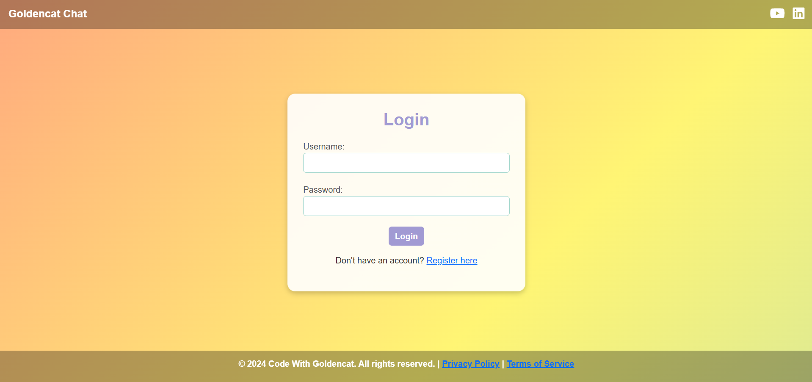
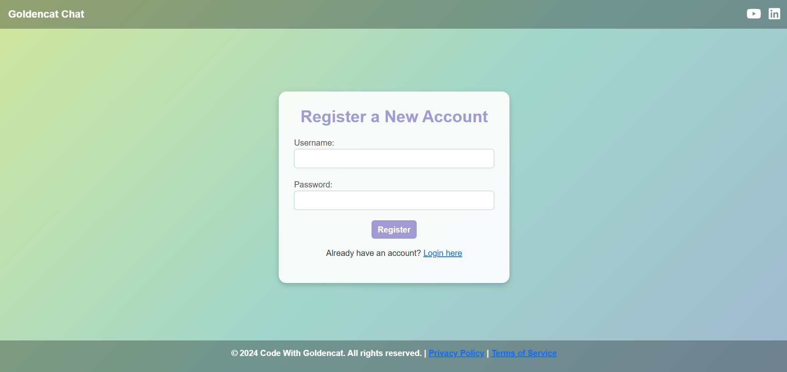
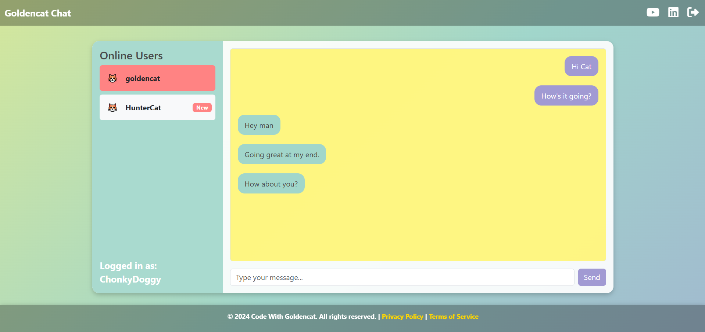

# Goldencat Chatroom

A real-time one to one chat web application built using Java 17, MySQL, Spring Boot, Spring Security, WebSocket, and Thymeleaf. This application allows users to chat with other users is a seperate environment, featuring a modern tech stack with a responsive user interface.

## Features

- **Instant Messaging**: Seamless, real-time communication enabled by WebSocket technology for instantaneous message delivery.
- **Secure Login and Registration**: User authentication and access management powered by Spring Security for a robust and secure experience.
- **User Notifications**: Instant alerts for new messages and user activity, such as logins, ensuring you stay updated in real-time.
- **Chat History Persistence**: Effortless storage and retrieval of chat data from a MySQL database, providing access to previous conversations anytime.
- **Responsive Interface**: Optimized for all devices using Bootstrap, delivering a consistent and user-friendly design across platforms.
- **Integrated Social Media Links**: Quick access to social profiles directly from the chatroom header for easy networking.

## Tech Stack

- **Backend**: Java 17, Spring Boot, Spring Security, MySQL Database, Lombok
- **Frontend**: Thymeleaf, Bootstrap, Font Awesome
- **Real-Time Communication**: Spring WebSocket, STOMP protocol
- **Build Tool**: Maven

## Setup Instructions

### Prerequisites
- Java 17 or higher
- Maven 3.6+

### Steps to Run Locally

1. **Clone the Repository**:
   ```sh
   git clone https://github.com/Goldencat98/ChatApp.git
   cd ChatApp
   ```
   
2. Create MySQL database using [SQLScript](src/main/resources/static/sql-script/SQLScript.txt)

3. Update MySQL password in [application.properties](src/main/resources/application.properties)

4. **Build the Project**:
   ```sh
   mvn clean install
   ```

5. **Run the Application**:
   ```sh
   mvn spring-boot:run
   ```

6. **Access the Application**:
   Open your browser and navigate to `http://localhost:8080`.

## Usage

- **Login**: Create a new account or securely log in using your existing credentials to access the platform.
- **Chat**: Engage in real-time conversations with other users. Stay informed with instant notifications when new users join or send you messages.

## License

This project is licensed under the **Goldencat Chatroom License**. You may use, modify, and distribute the software for personal, non-commercial use. Commercial use requires prior approval from the creator.

For more details, see the [LICENSE](./License.md) file.

## Contact

For permissions related to commercial use or any questions, please contact: Code With Goldencat (codingwithgoldencat@gmail.com)

## Contributions

Contributions are welcome! Feel free to open an issue or submit a pull request to improve the project.

## Screenshots





## Future Enhancements

- **Profile Management**: Update username, details, or profile picture.
- **Privacy Controls**: Block or restrict messages from others.
- **Message Encryption**: Ensure secure chats with encrypted storage and transmission.
- **Media Sharing**: Share images and files effortlessly in chats.  

